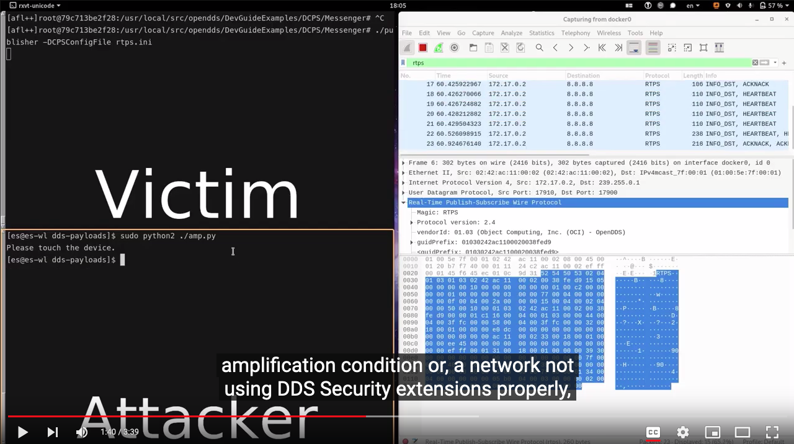

[](https://www.youtube.com/watch?v=GFiWgJ03_TI)

## The Data Distribution Service (DDS) Protocol is Critical: Let's Use it Securely! [^1]

[^1]: This page does not represent official content released by our employers. This page is merely intendend as an aggregator of public information about our research.

We found **12 vulnerabilities** across the top 6 DDS implementations, both closed and open source, plus **1 vulnerability in the standard** specifications.

We release part of the code that helped us run our research project and we're still working with the standard maintainer, possibly to revise the specifications.

| CVE ID         | Scope              | CWE      | CVSS  |Notes                     | Patched    |
|----------------|--------------------|----------|-------|--------------------------|------------|
| CVE-2021-38445 | OpenDDS            | CWE-130  | [H/M/H](https://www.first.org/cvss/calculator/3.0#CVSS:3.0/AV:N/AC:H/PR:N/UI:N/S:U/C:L/I:L/A:H/E:P/RL:O/RC:C/CR:M/AR:H) | Failed assertion          | [>= 3.18.1](https://github.com/objectcomputing/OpenDDS/releases/tag/DDS-3.18.1) |
| CVE-2021-38447 | OpenDDS            | CWE-405  | [H/H/H](https://www.first.org/cvss/calculator/3.0#CVSS:3.0/AV:N/AC:L/PR:N/UI:N/S:U/C:L/I:L/A:H/E:P/RL:O/RC:C/CR:M/AR:H) |Resource exhaustion       | [>= 3.18.1](https://github.com/objectcomputing/OpenDDS/releases/tag/DDS-3.18.1) |
| CVE-2021-38435 | RTI ConnextDDS         | CWE-131  | [H/H/H](https://www.first.org/cvss/calculator/3.0#CVSS:3.0/AV:N/AC:L/PR:N/UI:N/S:U/C:L/I:L/A:H/E:P/RL:O/RC:C/CR:M/AR:H) |Seg.fault via network     | [>= 6.1.0](https://community.rti.com/kb/ics-cert-security-notice-ics-vu-575352-vu770071) |
| CVE-2021-38423 | GurumDDS           | CWE-131  | [H/H/C](https://www.first.org/cvss/calculator/3.0#CVSS:3.0/AV:N/AC:L/PR:N/UI:N/S:U/C:L/I:L/A:H/E:P/RC:C/CR:M/AR:H) |Seg.fault via network     | N/A |
| CVE-2021-38439 | GurumDDS           | CWE-122  | [H/H/C](https://www.first.org/cvss/calculator/3.0#CVSS:3.0/AV:N/AC:L/PR:N/UI:N/S:U/C:L/I:L/A:H/E:P/RC:C/CR:M/AR:H) |Heap-overflow via network | N/A |
| CVE-2021-38437 | GurumDDS           | CWE-1104 | [H/M/H](https://www.first.org/cvss/calculator/3.0#CVSS:3.0/AV:L/AC:L/PR:N/UI:N/S:U/C:L/I:L/A:H/E:U/RC:C/CR:M/AR:H) |Unmaintained XML lib.     | N/A |
| CVE-2021-38441 | CycloneDDS         | CWE-123  | [M/M/M](https://www.first.org/cvss/calculator/3.0#CVSS:3.0/AV:L/AC:L/PR:L/UI:N/S:U/C:L/I:L/A:H/E:U/RL:O/RC:C/CR:M/AR:H)     |Heap-write in XML parser  | master |
| CVE-2021-38443 | CycloneDDS         | CWE-228  | [M/M/M](https://www.first.org/cvss/calculator/3.0#CVSS:3.0/AV:L/AC:L/PR:L/UI:N/S:U/C:L/I:L/A:H/E:U/RL:O/RC:C/CR:M/AR:H)     |8-bytes heap-write in XML parser        | master |
| CVE-2021-38427 | RTI ConnextDDS     | CWE-121  | [M/M/M](https://www.first.org/cvss/calculator/3.0#CVSS:3.0/AV:L/AC:L/PR:L/UI:N/S:U/C:L/I:L/A:H/E:U/RL:O/RC:C/CR:H/AR:H) |Stack overflow in XML parser | [>= 6.1.0](https://community.rti.com/kb/ics-cert-security-notice-ics-vu-575352-vu770071) |
| CVE-2021-38433 | RTI ConnextDDS     | CWE-121  | [M/M/M](https://www.first.org/cvss/calculator/3.0#CVSS:3.0/AV:L/AC:L/PR:L/UI:N/S:U/C:L/I:L/A:H/E:U/RL:O/RC:C/CR:H/AR:H) |Stack overflow in XML parser | [>= 6.1.0](https://community.rti.com/kb/ics-cert-security-notice-ics-vu-575352-vu770071) |

The following table refers to the spec-level vulnerability.

| CVE ID            | Scope           | CWE      | CVSS | Patched in                |
|----------------|--------------------|----------|------|---------------------------|
| Not applicable | OMG DDSI-RTPS 2.5  | CWE-406  | -    | WIP spec. revision |
| CVE-2021-38487 | ConnextDDS         | CWE-406  | [H/H/H](https://www.first.org/cvss/calculator/3.0#CVSS:3.0/AV:N/AC:L/PR:N/UI:N/S:U/C:L/I:L/A:H/E:P/RL:O/RC:C/CR:L/AR:H) | [Mitigation patch in >= 6.1.0](https://community.rti.com/kb/ics-cert-security-notice-ics-vu-575352-vu770071) |
| CVE-2021-38429 | OpenDDS            | CWE-406  | [H/H/H](https://www.first.org/cvss/calculator/3.0#CVSS:3.0/AV:N/AC:L/PR:N/UI:N/S:U/C:L/I:L/A:H/E:P/RL:O/RC:C/CR:L/AR:H) | [Mitigation patch in >= 3.18.1](https://github.com/objectcomputing/OpenDDS/releases/tag/DDS-3.18.1) |
| CVE-2021-38425 | eProsima Fast-DDS  | CWE-406  | [H/H/H](https://www.first.org/cvss/calculator/3.0#CVSS:3.0/AV:N/AC:L/PR:N/UI:N/S:U/C:L/I:L/A:H/E:P/RL:T/RC:C/CR:L/AR:H) | [WIP mitigation in master](https://github.com/eProsima/Fast-DDS/issues/2267)     |
| Requested      | Twin Oaks CoreDX   | CWE-406  | [H/H/H](https://www.first.org/cvss/calculator/3.0#CVSS:3.0/AV:N/AC:L/PR:N/UI:N/S:U/C:L/I:L/A:H/E:P/RL:O/RC:C/CR:L/AR:H) | > 5.9.1            |

## Talks and Publications

- [Black Hat Europe 2021](https://www.blackhat.com/eu-21/briefings/schedule/index.html#the-data-distribution-service-dds-protocol-is-critical-lets-use-it-securely-24934), The Data Distribution Service (DDS) Protocol is Critical: Let's Use it Securely! *Nov 11th, 2021, London, UK.*
- [ROS Industrial Conference 2021](https://rosindustrial.org/events/2021/12/1/ros-industrial-conference-2021), Breaking ROS 2 security assumptions: Targeting the top 6 DDS implementations. *Dec 1-2, 2021, Fraunhofer IPA, Stuttgart, Germany*
- [S4x22](https://s4xevents.com/speakers/), A Security Deep Dive Into The DDS Protocol. *Jan 27th, 2022, Miami, FL, USA.*

## What is DDS?

DDS is a middleware technology that enables crucial technologies like [autonomous driving](https://www.rti.com/blog/2016/02/24/dds-proof-points-for-autonomous-cars/), [healthcare machinery](https://www.rti.com/ge2015dec), military tactical systems, or [missile launch stations](https://www.aerospacetestinginternational.com/news/products-services/orion-prepares-for-space-with-advanced-data-acquisition-system.html). Designed around industrial-level requirements, DDS sits deep in the control network, allowing an arbitrary number of endpoints like sensors or actuators to communicate transparently, with an abstract API based on familiar data type specifications (e.g., C structs) and simple function calls, regardless of the complexity of the data.

```C++
using namespace org::eclipse::cyclonedds;

int main()
{
  dds::domain::DomainParticipant participant(0);
  dds::pub::Publisher publisher(participant));
  dds::topic::Topic<HelloWorld> topic(participant, "HelloWorld");
  dds::pub::DataWriter<HelloWorld> writer(publisher, topic);

  unsigned i = 0;
  while (true)
  {
    HelloWorld msg(i++, "Hello, world!");
    writer << msg;
    std::this_thread::sleep_for(std::chrono::seconds(1));
  }

  return 0;
}
```

## DDS Standards and Implementations

The OMG Data-Distribution Service for Real-Time Systems® (DDS®) is the first open international middleware standard directly addressing publish-subscribe communications for real-time and embedded systems. The DDS [specifications](https://www.dds-foundation.org/omg-dds-standard/) are public.

Focusing on [OMG members vendors](https://www.omg.org/dds-directory/vendor/list.htm), we looked at the 6 most popular implementations,:

- Open source
  - [Fast-DDS](https://github.com/eProsima/Fast-DDS) by [eProsima](https://www.eprosima.com/)
  - [OpenDDS](https://github.com/objectcomputing/OpenDDS) by [OCI](https://objectcomputing.com/)
  - [CycloneDDS](https://github.com/eclipse-cyclonedds/cyclonedds) by [Eclipse](https://www.eclipse.org) ([ADLINK](https://www.adlinktech.com/))

- Proprietary software:
  - ConnextDDS by [RTI]((https://www.rti.com):
    - [ConnextDDS](https://www.rti.com/free-trial)
    - [RTI ConnextDDS Connectors](https://github.com/rticommunity/rticonnextdds-connector)
  - [GurumDDS](https://www.gurum.cc/freetrial) by [Gurum Networks](https://www.gurum.cc/home)
  - [CoreDX DDS](http://www.twinoakscomputing.com/coredx/download) by [Twin Oaks Computing](http://www.twinoakscomputing.com/)

## Who Uses DDS?

Notably, DDS is the aerospace standard, it is used by [NASA at the KSC](https://www.omgwiki.org/ddsf/doku.php?id=ddsf:public:applications:aerospace_and_defense:nasa_launch_and_control_systems), by SIEMENS for smart grid applications, by Volkswagen and Bosch for autonomous valet parking systems, by NAV CANADA for ATC, by iRobot in your vacuum and most importantly, by the Robot Operating System 2 (ROS 2)[^2], which means, most future robots will be powered by it.

[^2]: [ROS](https://ros.org/) is the *de facto* standard for robot application development (the ultimate *robotics SDK*) a set of software libraries and tools that help you build robot applications.

DDS is the foundation of other industry standards including [OpenFMB](https://openfmb.ucaiug.org/), [Adaptive AUTOSAR](https://www.autosar.org/), [MD PnP](https://mdpnp.org/), [GVA](https://www.slideshare.net/RealTimeInnovations/generic-vehicle-architecture-dds-at-the-core), [NGVA](https://www.natogva.org/), and [ROS 2](https://design.ros2.org/articles/ros_on_dds.html).

Other applications are listed in the [DDS Foundation Wiki](https://www.omgwiki.org/ddsf/doku.php?id=ddsf:public:applications:start).

## Network Attack Surface

Being DDS mainly a network-based protocol, the network is also the main attack surface. We approached DDS from the bottom up, and the first thing we did was writing a [Scapy layer to dissect and forge RTPS frames](https://github.com/secdev/scapy/pull/3403) (RTPS, or Real-Time Publish Subscribe is the foundation of DDS). Inspecting DDS and RTPS frame is the best way to learn the packet structure. Although network fuzzing wasn't directly effective, it greatly helped us to master the tiny details of DDS. This led us to find an reflection/amplification vulnerability (CVE-2021-38487, CVE-2021-38429) in the standard, which allows an attacker to redirect flood an arbitrary host.

## Configuration Files Attack Surface

DDS configuration is highly dependent on XML, JSON, YAML, or similar formats, which make them another attack vector. By writing a Radamsa-based file fuzzer we found various parsing vulnerabilities (CVE-2021-38437, CVE-2021-38441, CVE-2021-38443, CVE-2021-38427, CVE-2021-38433) as well as one of the implementations using an old, unmaintained and vulnerable XML library (CVE-2021-38437), so an attacker can use a malicious configuration file to gain initial access.

## Continuous Fuzzing

We focus on fuzzing the message interpretation routines and configuration parsing in all implementations, how to pick good fuzz targets, and prepare them for popular frameworks like OSS-Fuzz and UnicornAFL (for closed-source implementations).

We're working on releasing fuzzers into OSS-Fuzz for the following implementations:

- Fast-DDS: [https://github.com/eProsima/Fast-DDS/tree/master/fuzz](https://github.com/eProsima/Fast-DDS/tree/master/fuzz) [^3]
- CycloneDDS: [https://github.com/google/oss-fuzz/tree/master/projects/cyclonedds](https://github.com/google/oss-fuzz/tree/master/projects/cyclonedds)
- OpenDDS: WIP

[^3]: The first integration of Fast-DDS into OSS-Fuzz was done spontaneously by Philippe Antoine ([@catenacyber](https://github.com/catenacyber)).

## Who are we?

Trend Micro Research has been leading this research, with the invaluable contribution of a great team, comprising researchers and experts from various realms.

- [Ta-Lun Yen](https://twitter.com/evanslify/), Threat Researcher, [TXOne Networks](https://www.txone-networks.com/)
- [Federico Maggi](https://maggi.cc), Senior Researcher, [Trend Micro Research](https://www.trendmicro.com/en_us/research.html)
- [Erik Boasson](https://github.com/eboasson), Senior Technologist and lead [CycloneDDS](https://github.com/eclipse-cyclonedds/cyclonedds) developer, [ADLINK Technology](https://www.adlinktech.com/)
- [Víctor Mayoral-Vilches](https://cybersecurityrobotics.net/author/victor/), Robotics Security Researcher, [Alias Robotics](https://aliasrobotics.com)
- [Mars Cheng](https://mars-cheng.github.io/blog/about/), Threat Researcher, [TXOne Networks](https://www.txone-networks.com/)
- Patrick Kuo, Threat Researcher, [TXOne Networks](https://www.txone-networks.com/)
- [Chizuru Toyama](https://www.linkedin.com/in/chizuru-toyama-0a070427/), Staff Engineer, [TXOne Networks](https://www.txone-networks.com/)

---
